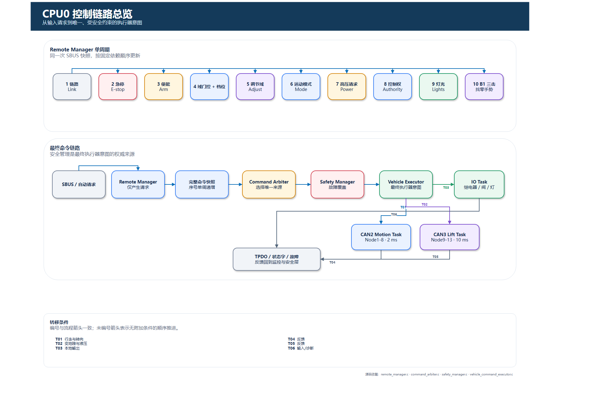
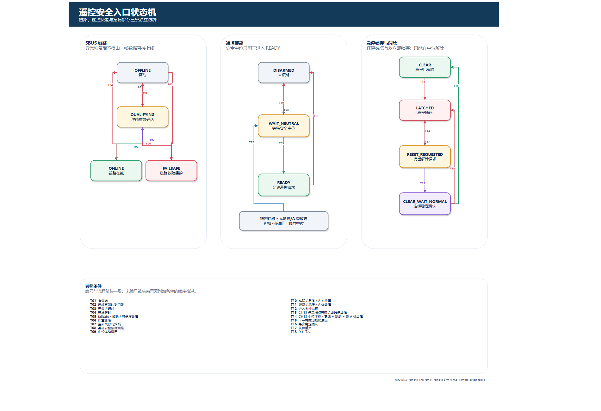
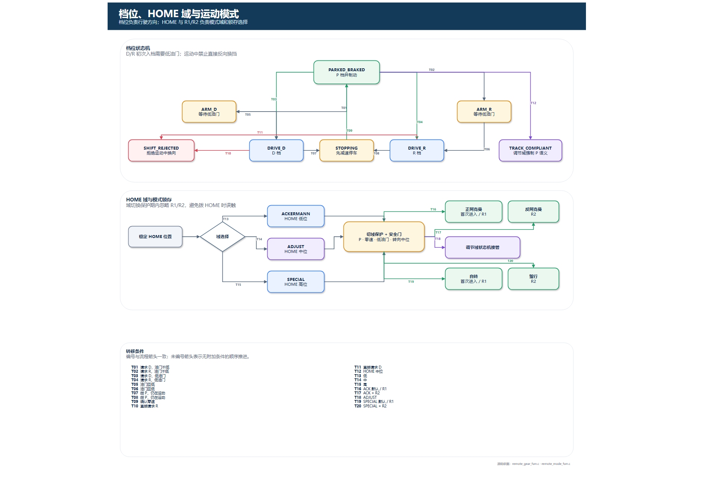
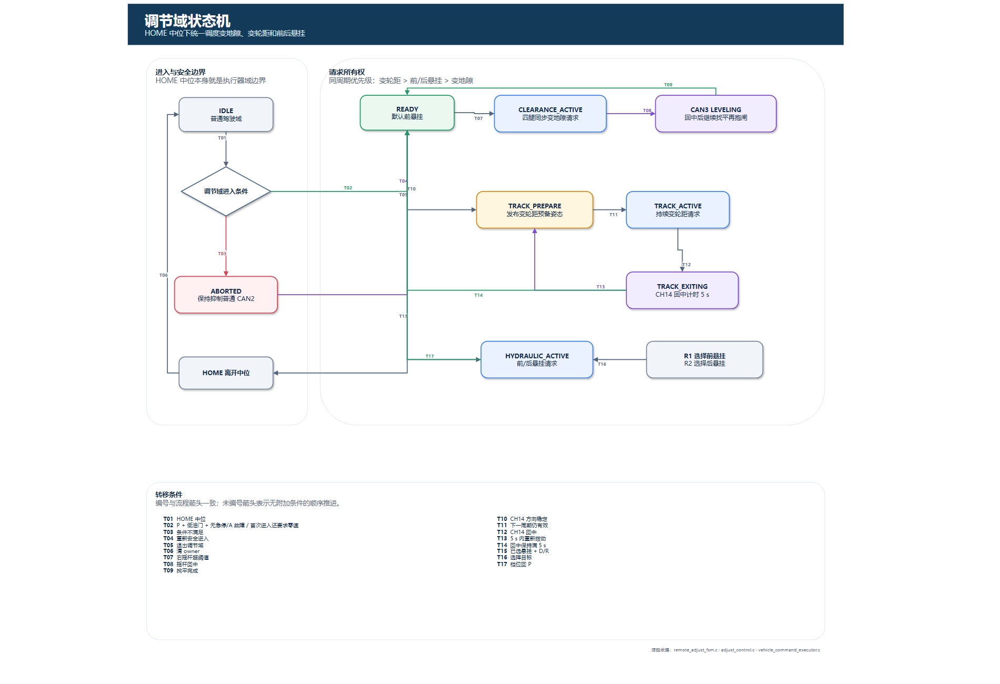
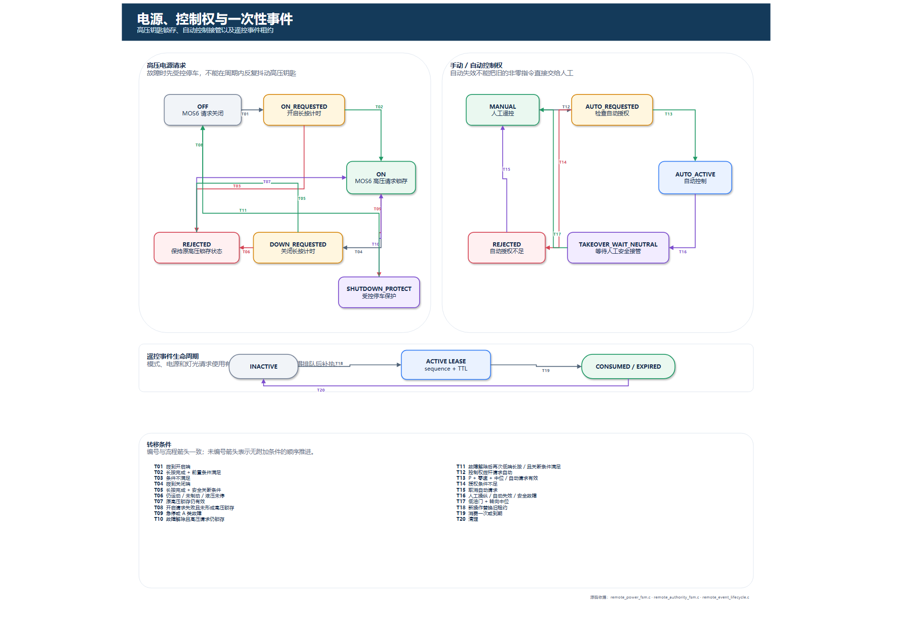
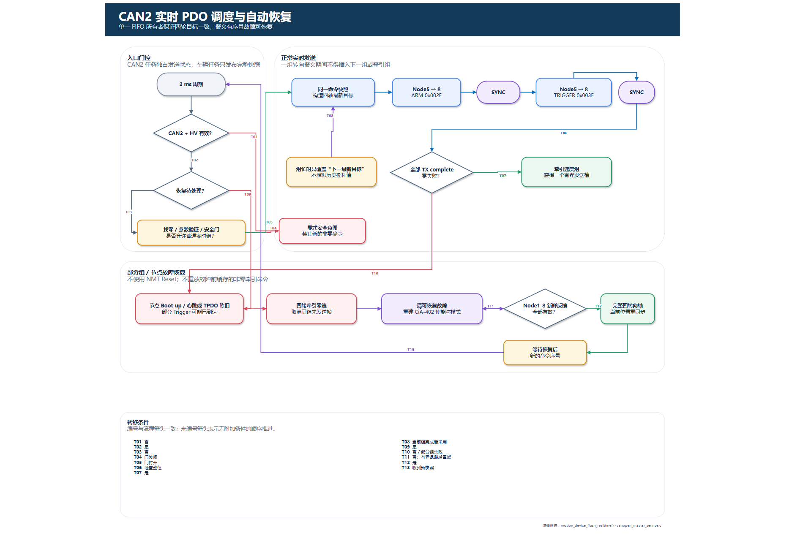
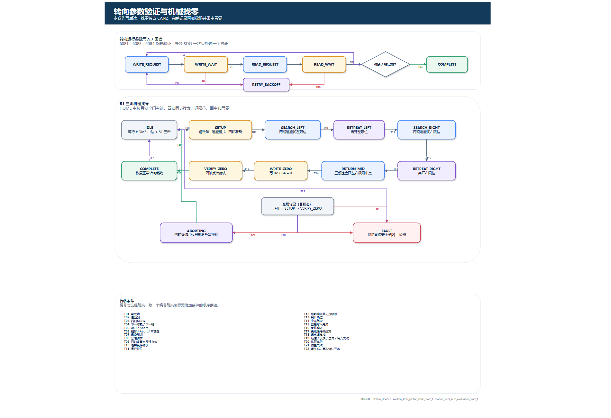
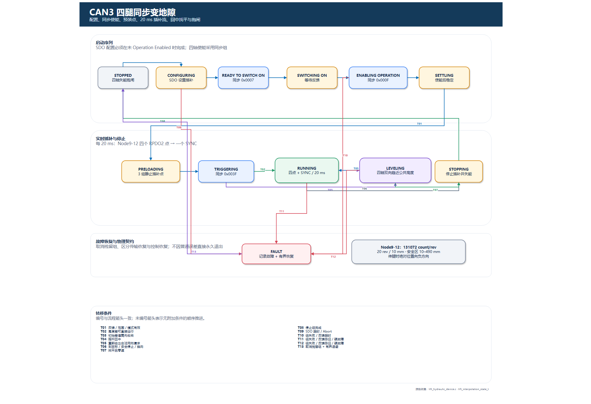
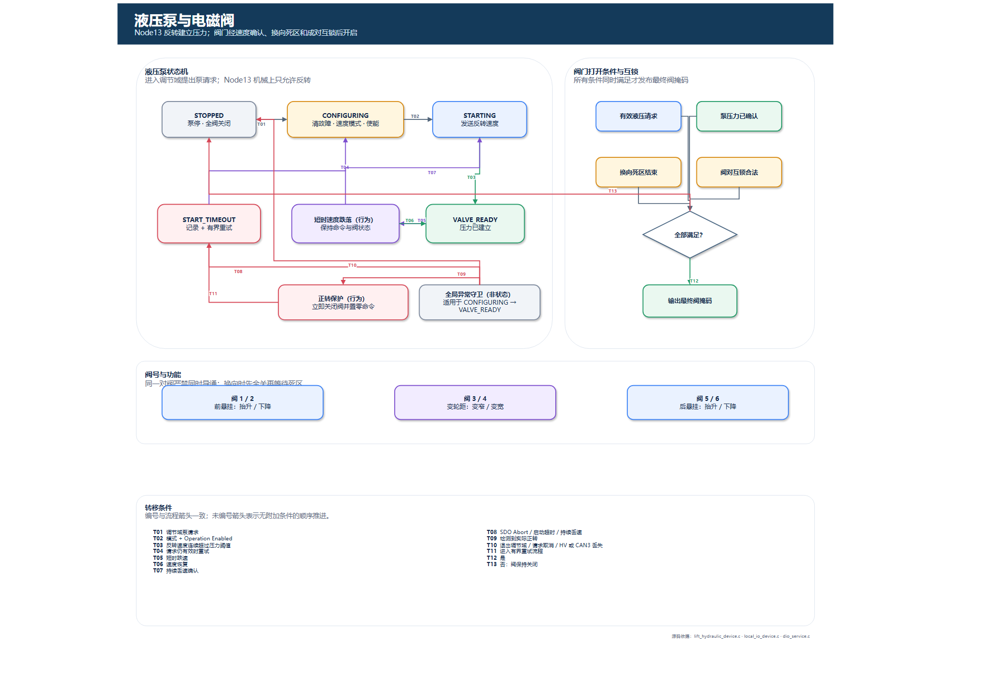
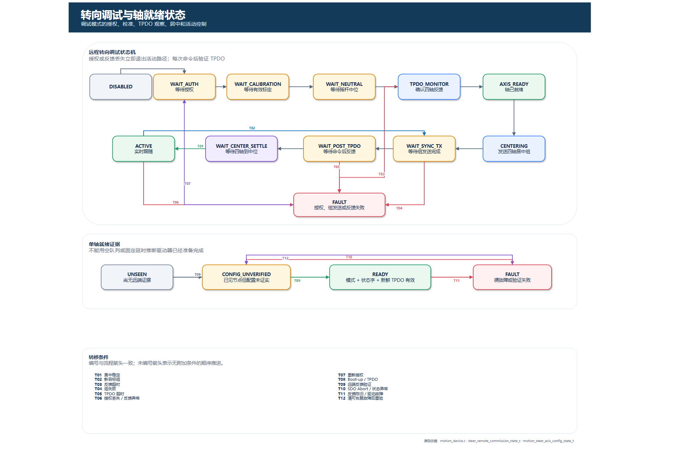

# ECU 状态机流程图册

> 适用代码：当前 `beta` 分支 CPU0 工程
> 更新日期：2026-07-16
> 可编辑源文件：[打开 Draw.io 多页图册](state_machine_diagrams/ECU_state_machines.drawio)
> 页面预览：由上述 Draw.io 文件实际渲染，便于在 Markdown 中直接审阅

## 视觉图例

| 颜色 | 含义 |
|---|---|
| 蓝色 | 正常控制、实时发送或活动状态 |
| 绿色 | 已确认安全、完成或允许执行 |
| 黄色 | 等待、配置、门控或过渡状态 |
| 红色 | 故障、拒绝、急停或安全抑制 |
| 紫色 | 找平、退出、恢复或维护流程 |
| 灰色 | 未激活、停止、输入或说明状态 |

图册将复杂流程拆成独立页面，避免在一张图中堆叠全部状态。图中连线使用 `T01`、`T02` 等编号，完整条件列在每页底部的“转换条件”表中，连线和条件编号一一对应。所有“执行请求”仍必须经过命令仲裁、安全管理和相应总线所有者；流程图不代表可以绕过该链路直接操作执行器。

## 1. CPU0 控制链路总览

从输入请求到唯一、受安全约束的执行器意图

源码依据：`remote_manager.c`、`command_arbiter.c`、`safety_manager.c`、`vehicle_command_executor.c`

## 2. 遥控安全入口状态机

链路、遥控使能与急停锁存三条独立防线

源码依据：`remote_link_fsm.c`、`remote_arm_fsm.c`、`remote_estop_fsm.c`

## 3. 档位、HOME 域与运动模式

档位负责行驶方向；HOME 与 R1/R2 负责模式域和锁存选择

源码依据：`remote_gear_fsm.c`、`remote_mode_fsm.c`

## 4. 调节域状态机

HOME 中位下统一调度变地隙、变轮距和前后悬挂

源码依据：`remote_adjust_fsm.c`、`adjust_control.c`、`vehicle_command_executor.c`

## 5. 电源、控制权与一次性事件

高压钥匙锁存、自动控制接管以及遥控事件租约

源码依据：`remote_power_fsm.c`、`remote_authority_fsm.c`、`remote_event_lifecycle.c`

## 6. CAN2 实时 PDO 调度与自动恢复

单一 FIFO 所有者保证四轮目标一致、报文有序且故障可恢复

源码依据：`motion_device_flush_realtime()`、`canopen_master_service.c`

## 7. 转向参数验证与机械找零

参数先写后读；找零独占 CAN2，完整记录两侧极限并回中置零

源码依据：`motion_device.c`、`motion_steer_profile_setup_state_t`、`motion_steer_zero_calibration_state_t`

## 8. CAN3 四腿同步变地隙

配置、同步使能、预装点、20 ms 插补流、中位同步失能与重新启动

源码依据：`lift_hydraulic_device.c`、`lift_interpolation_state_t`

单位说明：已确认 Node9–12 编码器为 `131072 count/rev`，机构传动比为 `20 motor rev/10 mm`，因此换算系数为 `262144 count/mm`；正常控制安全范围为 `10–490 mm`。该口径与当前 `ecu_config.h`、`AGENTS.md` 和变地隙调试工具一致。

## 9. 液压泵与电磁阀

Node13 反转建立压力；阀门经速度确认、换向死区和成对互锁后开启

源码依据：`lift_hydraulic_device.c`、`local_io_device.c`、`dio_service.c`

## 10. 转向调试与轴就绪状态

调试模式的授权、校准、TPDO 观察、居中和活动控制

源码依据：`motion_device.c`、`steer_remote_commission_state_t`、`motion_steer_axis_config_state_t`

## 阅读顺序

1. 先看第 1 页，明确请求、仲裁、安全覆盖和执行器所有权。
2. 再看第 2–5 页，理解遥控输入如何变成合法车辆请求。
3. 第 6、7、10 页对应 CAN2 实时转向、恢复、找零与调试路径。
4. 第 8、9 页对应 CAN3 四腿同步变地隙、液压泵和阀门互锁。

本图册描述当前源码逻辑，不等同于硬件已经验证。若状态枚举、门限、恢复策略、节点映射或物理单位发生变化，应直接更新可编辑的 Draw.io 源文件，重新导出预览，并逐页复核连线编号、转换条件与源码的一致性。
